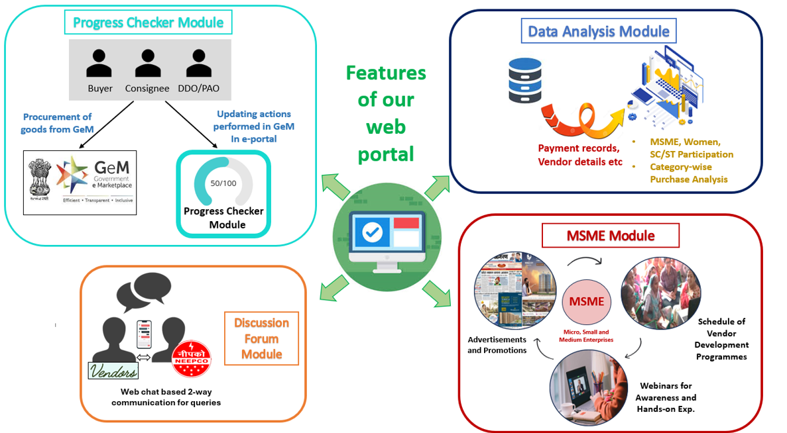
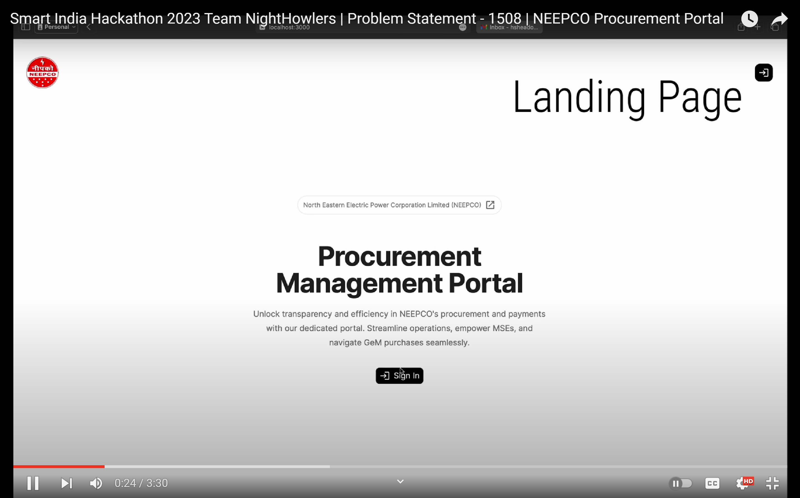
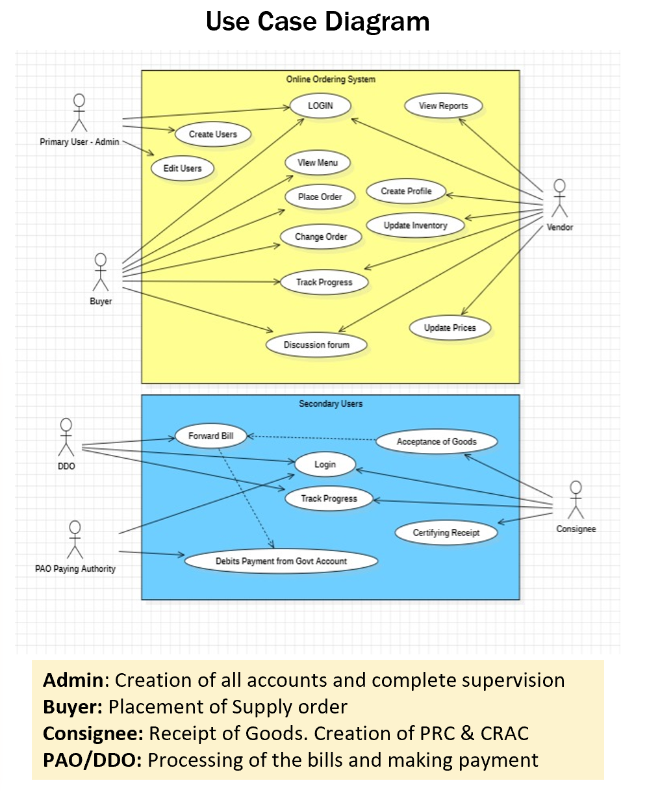

# NEEPCO Procurement Management Portal Server

- Our Aim is to develop an online portal for NEEPCO (North Eastern Electric Power Corporaton) so that the process of procurement of goods can be streamlined.
- The online portal will maintain a detailed record of the procurement activities (including payments) and vendor details.
- Efficient data entry, storage, retrieval will be given prime importance. Securing sensitive data about the payment transactions and about the members involved will also be done.
- The portal will also have additional features such as progress tracking,data analysis, RBAC (Role Based Access Control) and discussion forums.

# Features


## To Run

```
npm install
npm start
```

# Youtube
[](https://www.youtube.com/watch?v=fSEUm5lBdsc)

# Use Case


> [!Note]
> This project was done as a part of Smart India Hackathon 2023.

# Links
Link to [`Frontend Repository`](https://github.com/Ashrockzzz2003/sih_neepco_web)

Link to  [`Dockerhub Repo`](https://hub.docker.com/repository/docker/abhinavark/sih_neepco/general)
